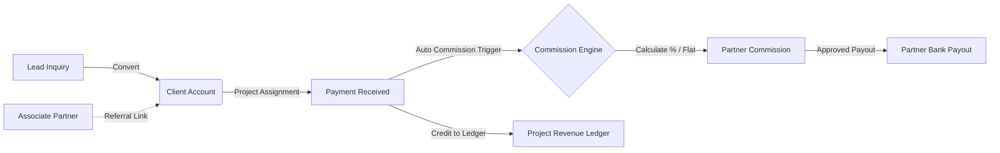
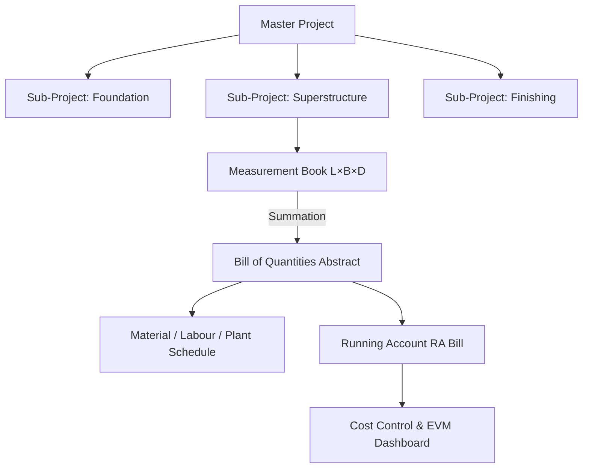

# 🏗️ BuildForce 360 (InfraPilot)

> **Enterprise-Grade Construction Management ERP, Engineering Estimation Engine & Commercial Lifecycle Platform**


---

## 📖 Table of Contents

- [Overview](#-overview)
- [System Architecture & Data Flow](#-system-architecture--data-flow)
- [Key Modules & Capabilities](#-key-modules--capabilities)
  - [1. Commercial & Client Lifecycle Flow](#1-commercial--client-lifecycle-flow)
  - [2. Associate & Reference Partner Ecosystem](#2-associate--reference-partner-ecosystem)
  - [3. Master Project & Autonomous Sub-Projects](#3-master-project--autonomous-sub-projects)
  - [4. Intelligent Dimensional Measurement Book (MB)](#4-intelligent-dimensional-measurement-book-mb)
  - [5. Dynamic Bill of Quantities (BOQ) & Abstract](#5-dynamic-bill-of-quantities-boq--abstract)
  - [6. Quantity Master (Materials, Manpower, Machinery & Formulas)](#6-quantity-master-resource--pricing-engine)
  - [7. Running Account (RA) Billing & Deductions](#7-running-account-ra-billing--deductions)
  - [8. Cost Control & EVM Variance Analysis](#8-cost-control--evm-variance-analysis)
  - [9. Recycle Bin Safeguard & Audit Logs](#9-recycle-bin-safeguard--audit-logs)
- [Technology Stack Matrix](#-technology-stack-matrix)
- [Project Directory Structure](#-project-directory-structure)
- [Getting Started & Local Setup](#-getting-started--local-setup)
  - [Prerequisites](#prerequisites)
  - [1. Backend Setup](#1-backend-setup)
  - [2. Frontend Setup](#2-frontend-setup)
  - [3. Seeding Database & Demo Accounts](#3-seeding-database--demo-accounts)
- [Exhaustive REST API Reference](#-exhaustive-rest-api-reference)
- [Environment Configuration Guide](#-environment-configuration-guide)
- [Available Scripts](#-available-scripts)
- [Engineering Standards & Math Precision](#-engineering-standards--math-precision)
- [License](#-license)

---

## 🌟 Overview

**BuildForce 360** (formerly *InfraPilot*) is an enterprise Construction Resource Planning (ERP) and project management solution built for infrastructure developers, general contractors, quantity surveyors, civil engineers, and business acquisition teams.

Traditional construction operations suffer from disconnected workflows: lead acquisitions are logged on loose note sheets, measurements sit in isolated Excel files, bills lack audit traceability, and referral commissions lead to manual disputes. BuildForce 360 addresses these challenges by merging **civil engineering estimation** with a **unified commercial lifecycle**:

1. **Lead Acquisition & Client Conversion**: Real-time sales pipeline connecting inquiries directly to client accounts.
2. **Associate Partner Network & Commissions**: Automatic, fraud-proof commission calculation triggered on client payments.
3. **Master Project Breakdown**: Division of major sites into autonomous Sub-Projects (Towers, Wings, Foundations, Finishes).
4. **CPWD / DSR Standard SOR Catalog**: Integration with official Schedule of Rates specifications.
5. **Smart $L \times B \times D$ Measurement Book**: Inline mathematical expressions, deduction lines, and automatic abstract generation.
6. **Progressive RA Billing**: Multi-stage billing with automated retention money, tax withholding (TDS, GST TDS), and statutory cess.

---

## 🏛️ System Architecture & Data Flow

### 1. Unified Commercial & Financial Flow



### 2. Engineering & Construction Execution Flow



---

## 🚀 Key Modules & Capabilities

### 1. Commercial & Client Lifecycle Flow

A single source of truth guiding inquiries through revenue realization:

- **Lead Management**:
  - Tracking through visual statuses: `New`, `Contacted`, `Site Visit Scheduled`, `Proposal Sent`, `Negotiation`, `Won`, `Lost`.
  - Priority markers: `🔥 High`, `⚡ Urgent`, `Medium`, `Low`.
  - Complete interaction history: follow-up schedules, call notes, and activity timeline.
  - Quick action: **Convert to Client** in a single click without data duplication.
- **Client Management & Dossier**:
  - Profile storage: Client type (Individual, Corporate, Government), GSTIN, PAN, billing addresses.
  - Multi-service assignments: Architectural & Structural Planning, 3D Elevation, Interior Design, Site Supervision, Civil Execution.
  - Project milestone schedule with payment stages and progress tracking.
  - Daily Progress Reports (DPR) submission and client dossier exports.
- **Client Payment Processing**:
  - Payment records: Bank Transfer, NEFT/RTGS, UPI, Cheque, Cash.
  - Direct ledger reconciliation updating outstanding balances and advance reserves.

---

### 2. Associate & Reference Partner Ecosystem

Empowers infrastructure companies to scale channel sales and referral networks:

- **Partner Directory**: Registry of architects, brokers, liaison consultants, and channel partners.
- **Dynamic Commission Structures**: Supports both Percentage-based (`%` of payment) and Flat-rate (`₹`) commission agreements.
- **Real-Time Commission Generation**: Once a client payment is recorded, the centralized commission service automatically computes the partner fee and links it directly to the payment transaction.
- **Partner Payout Processing**: Disburse partner payouts with reference IDs, payment modes, TDS deductions, and instant payment receipts.
- **Commission Analytics**: Comprehensive reporting on total commissions generated, balances pending release, and top-performing partners.

---

### 3. Master Project & Autonomous Sub-Projects

Mirrors modern infrastructure delivery hierarchies:

- **Master Project Hub**: Strategic level view tracking global contract value, total billed volume, overall project health, and shared metadata.
- **Autonomous Sub-Projects**: Breakdown of master developments into towers, phases, or civil work packages.
  - Each sub-project has its own autonomous **Measurement Book**, **BOQ Abstract**, **Material Requirements (BOM)**, **Labour Allocation**, **Machinery Tracking**, and **Running Account Bills**.
  - Prevents erroneous root-level quantity bookings while providing aggregated rollups to the executive team.

---

### 4. Intelligent Dimensional Measurement Book (MB)

Eliminates manual calculation errors with embedded engineering intelligence:

- **Civil Standard Dimensions**: Standardized tabular format tracking `Item No`, `Description`, `Nos`, `Length (L)`, `Breadth/Width (B)`, `Depth/Height (D)`, and `Total Quantity`.
- **Inline Expression Evaluator**: Enter dynamic math directly into dimension fields (e.g., `(3.4 + 2.1) / 2 * 1.15`).
- **Deduction Lines**: Mark rows as deductions (door/window openings, beam cutouts, column voids) with automatic subtraction.
- **Slash Formula Presets**: Rapidly inject geometric quantity formulas (trapezoidal footings, circular manholes, trench bedding).
- **Sub-headings & Group Totals**: Logical organization by floor levels, gridlines, or execution stages.

---

### 5. Dynamic Bill of Quantities (BOQ) & Abstract

- **Live Abstract Synchronization**: Quantities recorded in the Measurement Book flow seamlessly into the BOQ abstract.
- **Tendered vs. Executed Tracking**: Instant identification of deviations and extra items beyond sanctioned allowances.
- **SOR / DSR Item Linking**: Direct connection to standard rate schedule clauses and custom rate lists.
- **Export Capabilities**: Clean, branded Excel spreadsheets and PDF abstracts formatted for client and government submission.

---

### 6. Quantity Master (Resource & Pricing Engine)

Centralized costing and rate analysis engine:

- **Materials Master**: Catalog with HSN codes, base purchase rates, tax classifications, and units of measurement (Bags, Tonnes, CUM, SQM).
- **Manpower Master**: Skilled, semi-skilled, unskilled, and supervisory wage rates per shift and per hour.
- **Machinery & Plant Master**: Equipment directory tracking wet/dry lease costs, hourly fuel consumption, and output coefficients.
- **Dynamic Rate Analysis Formulas**: Composable equations defining material factors, labor hours, and equipment hours required per unit output.
- **Custom Location Rate Lists**: District or regional override schedules enabling multi-site deployments with dynamic rate updates.
- **Schedule of Rates (SOR / CPWD DSR)**: Built-in library of CPWD Delhi Schedule of Rates specifications.

---

### 7. Running Account (RA) Billing & Deductions

- **Automated Billing Workflow**: Compiles approved Measurement Book entries into progressive, numbered RA bills (Bill #1, Bill #2, Final Bill).
- **Statutory & Contractual Withholding**:
  - Retention Money (e.g., 5% to 10%)
  - Mobilization Advance Recovery
  - Income Tax TDS (Section 194C / 194J) & GST TDS (2%)
  - Labor Welfare Cess (BOCW 1%)
  - Security Deposit & Penalty Deductions
- **Ledger Generation**: Clear presentation of Gross Bill Amount, Previous Recoveries, Current Deductions, and Net Payable.

---

### 8. Cost Control & EVM Variance Analysis

- **Earned Value Management (EVM)**: Tracks Planned Value (PV), Earned Value (EV), and Actual Cost (AC).
- **Schedule & Cost Variances**: Live Schedule Variance ($SV = EV - PV$) and Cost Variance ($CV = EV - AC$).
- **Direct Resource Breakdown**: Aggregated consumption costs across materials, manpower, and machinery against contract values.

---

### 9. Recycle Bin Safeguard & Audit Logs

- **Two-Stage Deletion**: Deleted projects, leads, or partners move to a Recycle Bin with full restore capabilities.
- **Audit Trails**: Every modification, rate override, and payment record is stored with user identity, timestamp, and IP tracking.

---

## 💻 Technology Stack Matrix

| Area | Technologies | Purpose |
|---|---|---|
| **Frontend Core** | [React 18](https://react.dev/), [TypeScript 5](https://www.typescriptlang.org/) | Type-safe UI components and reactive state |
| **Build Tool** | [Vite 6](https://vitejs.dev/) | Sub-second Hot Module Replacement (HMR) & bundling |
| **Styling** | [Tailwind CSS 3](https://tailwindcss.com/) | Dark glassmorphism, responsive mobile layout, custom tokens |
| **Server State** | [TanStack React Query v5](https://tanstack.com/query/latest) | Request caching, optimistic mutations, query invalidation |
| **HTTP Client** | [Axios](https://axios-http.com/) | REST API interaction with interceptors and token propagation |
| **Document Export** | [jsPDF](https://github.com/parallax/jsPDF), [jsPDF-AutoTable](https://github.com/simonbengtsson/jsPDF-AutoTable), [XLSX](https://sheetjs.com/) | Client-side generation of Excel sheets and PDF estimates |
| **Icons** | [Lucide React](https://lucide.dev/) | Consistent iconography across mobile and desktop views |
| **Backend Core** | [Node.js](https://nodejs.org/), [Express 4](https://expressjs.com/), [TypeScript](https://www.typescriptlang.org/) | Modular RESTful architecture |
| **Runtime Execution** | [tsx](https://github.com/privatenumber/tsx) | Fast TypeScript execution without manual precompilation |
| **Database** | [MongoDB 6+](https://www.mongodb.com/), [Mongoose 8](https://mongoosejs.com/) | Document database with multi-tenant company scoping |
| **Security** | [JWT](https://jwt.io/), [bcryptjs](https://github.com/dcodeIO/bcrypt.js), [Helmet](https://helmetjs.github.io/), CORS | Role-based authorization and header hardening |
| **Validation** | [Zod 3](https://zod.dev/) | Runtime request payload validation |
| **File Processing** | [Multer](https://github.com/expressjs/multer), [pdf-parse](https://github.com/mozilla/pdf.js) | Rate schedule uploads and PDF text extraction |

---

## 📂 Project Directory Structure

```text
buildForce360/
├── client/                                 # Frontend React Application
│   ├── public/                             # Static brand assets & logos
│   ├── src/
│   │   ├── app/                            # Global providers & route config
│   │   │   ├── providers.tsx
│   │   │   └── router.tsx
│   │   ├── components/                     # Reusable UI & Feature components
│   │   │   ├── common/                     # Button, Modal, Card, Loader, ErrorBoundary
│   │   │   ├── home/                       # Portfolio widgets, Project tables, Charts
│   │   │   ├── layout/                     # Sidebar, AppLayout, Header, Breadcrumbs
│   │   │   ├── leads/                      # Lead Modals, Associate Partner & Client forms
│   │   │   ├── measurements/               # SmartMeasurementModal, Formulas, Aliases
│   │   │   ├── projects/                   # ProjectGrid, ProjectCard
│   │   │   └── sor/                        # SOR Import & Chapter selection modals
│   │   ├── context/                        # AuthContext, ThemeContext
│   │   ├── hooks/                          # Custom hooks (auth, mobile viewport, debounce)
│   │   ├── pages/                          # Primary ERP Pages
│   │   │   ├── leads/
│   │   │   │   ├── LeadManagement.tsx      # Inquiries pipeline & status tracking
│   │   │   │   ├── ClientManagement.tsx    # Client registry, service plans & dossiers
│   │   │   │   ├── PaymentManagement.tsx   # Client payment records & invoicing
│   │   │   │   ├── ReferencePartners.tsx   # Associate partner directory & tiers
│   │   │   │   ├── CommissionReports.tsx   # Commission ledger & payout reconciliation
│   │   │   │   └── PayoutManagement.tsx    # Partner payout processing
│   │   │   ├── Home.tsx                    # Executive portfolio dashboard
│   │   │   ├── Login.tsx                   # Tenant authentication portal
│   │   │   ├── Register.tsx                # Organization registration
│   │   │   ├── ProjectWorkspace.tsx        # Project & Sub-Project workspace (BOQ, MB, Bills)
│   │   │   ├── QuantityMaster.tsx          # Resource database (Materials, Labor, Plant)
│   │   │   ├── RateMaster.tsx              # CPWD SOR Explorer & Rate Assistant
│   │   │   ├── RecycleBin.tsx              # Soft-deleted items recovery vault
│   │   │   ├── Settings.tsx                # Company profile & team management
│   │   │   └── Help.tsx                    # In-app user manual & guides
│   │   ├── services/                       # API integration modules
│   │   ├── types/                          # Shared TypeScript domain contracts
│   │   ├── utils/                          # CurrencyUtil, UnitEngine, PDF generators
│   │   ├── App.tsx                         # Top-level application component
│   │   ├── index.css                       # Global styles & Tailwind CSS definitions
│   │   └── main.tsx                        # DOM bootstrap entry point
│   ├── package.json
│   ├── tailwind.config.js
│   └── vite.config.ts
│
├── server/                                 # Backend Node.js Express API
│   ├── src/
│   │   ├── config/                         # DB connection, logger, environment config
│   │   ├── middleware/                     # JWT Auth, RBAC, Validation, Error Handling
│   │   ├── models/                         # Mongoose Data Models
│   │   │   ├── Company.ts                  # Tenant organization model
│   │   │   ├── User.ts                     # User accounts & role definitions
│   │   │   ├── Project.ts                  # Master & Sub-Project entities
│   │   │   ├── Lead.ts                     # Commercial leads & inquiries
│   │   │   ├── Client.ts                   # Active clients & service contracts
│   │   │   ├── Partner.ts                  # Associate referral partners
│   │   │   ├── Payment.ts                  # Client payment transactions
│   │   │   ├── Commission.ts               # Partner commission records
│   │   │   ├── Payout.ts                   # Partner payout disbursements
│   │   │   ├── SorMaster.ts                # Schedule of Rates & clause chapters
│   │   │   ├── Material.ts                 # Materials master index
│   │   │   ├── Labour.ts                   # Labour wage scales & trades
│   │   │   ├── Machinery.ts                # Plant & equipment hourly indices
│   │   │   ├── Boq.ts                      # Bill of Quantities schedules
│   │   │   ├── Measurement.ts              # Measurement Book entry records
│   │   │   ├── RunningBill.ts              # RA Bills & deduction ledgers
│   │   │   └── AuditLog.ts                 # Audit history records
│   │   ├── modules/                        # Domain Controller & Service Modules
│   │   │   ├── audit/                      # System change auditing
│   │   │   ├── auth/                       # Login, registration, profile service
│   │   │   ├── billing/                    # RA bill calculations & deductions
│   │   │   ├── boq/                        # BOQ generation & updates
│   │   │   ├── leads/                      # Leads, Clients, Partners, Commissions, Payouts
│   │   │   ├── measurements/               # Measurement Book processing
│   │   │   ├── projects/                   # Master/Sub-Project management
│   │   │   ├── quantityMaster/             # Catalog management & PDF parsing
│   │   │   ├── resources/                  # BOM, Labor, and Machinery aggregation
│   │   │   └── sor/                        # SOR explorer & rate search
│   │   ├── routes/                         # Central API routing table
│   │   ├── scripts/                        # Database seeders & demo fixtures
│   │   │   └── seed.ts
│   │   └── server.ts                       # HTTP server entry point
│   ├── package.json
│   └── tsconfig.json
│
└── README.md                               # Complete System Documentation
```

---

## ⚡ Getting Started & Local Setup

### Prerequisites

Ensure the following tools are installed:
- **Node.js**: v18.0.0 or higher ([Download Node.js](https://nodejs.org/))
- **npm**: v9.0.0 or higher (included with Node.js)
- **MongoDB**: Community Server v6.0+ running on `localhost:27017` or a MongoDB Atlas URI
- **Git**: Installed for version control

---

### 1. Backend Setup

1. Open a terminal and enter the `server` directory:
   ```bash
   cd server
   ```

2. Install backend dependencies:
   ```bash
   npm install
   ```

3. Configure environment variables:
   ```bash
   # On Windows PowerShell:
   Copy-Item .env.example .env

   # On Linux/macOS:
   cp .env.example .env
   ```

4. Verify your `server/.env` parameters:
   ```env
   PORT=5000
   MONGODB_URI=mongodb://127.0.0.1:27017/civil_guruji_erp
   JWT_SECRET=buildforce360_production_jwt_secret_key_2026
   JWT_EXPIRES_IN=7d
   CLIENT_URL=http://localhost:5173
   NODE_ENV=development
   ```

5. Seed master data (CPWD SOR items, resource libraries, sample projects, and leads):
   ```bash
   npm run seed
   ```

6. Launch the backend API:
   ```bash
   npm run dev
   ```
   *The backend will be running at `http://localhost:5000`.*

---

### 2. Frontend Setup

1. Open a second terminal and navigate to the `client` directory:
   ```bash
   cd client
   ```

2. Install frontend dependencies:
   ```bash
   npm install
   ```

3. Configure client environment:
   ```bash
   # On Windows PowerShell:
   Copy-Item .env.example .env

   # On Linux/macOS:
   cp .env.example .env
   ```

4. Ensure `client/.env` points to your backend:
   ```env
   VITE_API_URL=http://localhost:5000/api
   ```

5. Start the Vite development server:
   ```bash
   npm run dev
   ```
   *The application will open at `http://localhost:5173`.*

---

### 3. Seeding Database & Demo Accounts

When running `npm run seed`, the database is populated with an enterprise construction workspace, CPWD rate schedules, materials, equipment, sample projects, and pre-configured lead records.

#### Default Credentials:

| Role | Email Address | Password | Permissions |
|---|---|---|---|
| **System Administrator** | `admin@civilguruji.com` | `Civil@123` | Full access to all modules, billing, settings & finance |
| **Project Manager** | `manager@civilguruji.com` | `Civil@123` | Project execution, BOQ, MB, DPR, and site operations |

---

## 📡 Exhaustive REST API Reference

All routes are mounted under the `/api` prefix. Protected routes require a Bearer token: `Authorization: Bearer <JWT_TOKEN>`.

### 1. Authentication (`/api/auth`)
| Method | Endpoint | Description |
|---|---|---|
| `POST` | `/api/auth/register` | Register a new construction company and admin user |
| `POST` | `/api/auth/login` | Authenticate user and obtain JWT session token |
| `GET` | `/api/auth/me` | Fetch active user profile, company details, and permissions |

### 2. Commercial Leads & Inquiries (`/api/leads`)
| Method | Endpoint | Description |
|---|---|---|
| `GET` | `/api/leads` | List leads with filtering (status, priority, search, pagination) |
| `GET` | `/api/leads/stats` | Pipeline KPI stats (total inquiries, won, lost, pipeline value) |
| `POST` | `/api/leads` | Create a new lead inquiry |
| `GET` | `/api/leads/:id` | Fetch detailed lead profile and interaction history |
| `PUT` | `/api/leads/:id` | Update lead information |
| `POST` | `/api/leads/:id/follow-up` | Append follow-up communication record |
| `POST` | `/api/leads/:id/mark-dead` | Mark inquiry as dead/inactive |
| `POST` | `/api/leads/:id/restore` | Restore dead lead back to active pipeline |
| `POST` | `/api/leads/:id/convert-client` | Convert lead into an active Client account |
| `DELETE` | `/api/leads/:id` | Soft delete lead record |

### 3. Clients & Services (`/api/leads/clients`)
| Method | Endpoint | Description |
|---|---|---|
| `GET` | `/api/leads/clients/all` | Retrieve all client accounts with project links |
| `GET` | `/api/leads/clients/:id` | Get single client profile, assigned services, and ledger |
| `PUT` | `/api/leads/clients/:id` | Update client details and service packages |
| `POST` | `/api/leads/clients/:id/follow-up` | Record client relationship update |
| `POST` | `/api/leads/clients/:id/ledger` | Save customized project payment milestone schedule |
| `POST` | `/api/leads/clients/:id/pay-stage` | Settle specific milestone stage in ledger |
| `POST` | `/api/leads/clients/:id/dpr` | Submit Daily Progress Report (DPR) for client |
| `GET` | `/api/leads/clients/:id/dossier` | Export comprehensive client dossier |
| `DELETE` | `/api/leads/clients/:id` | Soft delete client profile |

### 4. Payments & Financial Transactions (`/api/leads/payments`)
| Method | Endpoint | Description |
|---|---|---|
| `GET` | `/api/leads/payments/all` | List all client incoming payments with date filters |
| `POST` | `/api/leads/payments/pay` | Record client payment & automatically generate partner commission |

### 5. Associate Partners & Payouts (`/api/leads/partners` & `/payouts`)
| Method | Endpoint | Description |
|---|---|---|
| `GET` | `/api/leads/partners/all` | List all associate/referral partners and commission stats |
| `POST` | `/api/leads/partners/create` | Register new associate partner |
| `PUT` | `/api/leads/partners/:id` | Update associate partner profile & commission rate |
| `DELETE` | `/api/leads/partners/:id` | Delete associate partner |
| `GET` | `/api/leads/payouts/all` | List all disbursed partner payouts |
| `POST` | `/api/leads/payouts/pay` | Process partner payout against accumulated commission |
| `GET` | `/api/leads/commissions/report` | Summary report of commissions earned, paid, and outstanding |

### 6. Projects & Sub-Projects (`/api/projects`)
| Method | Endpoint | Description |
|---|---|---|
| `GET` | `/api/projects` | List active projects (supports filtering by master/sub-project) |
| `POST` | `/api/projects` | Initialize a new Master Project or Sub-Project package |
| `GET` | `/api/projects/:id` | Get complete project workspace hierarchy and financials |
| `PUT` | `/api/projects/:id` | Update project metadata, duration, or sanctioned budget |
| `DELETE` | `/api/projects/:id` | Soft delete project to Recycle Bin |

### 7. Measurement Book (MB) (`/api/projects/:projectId/measurements`)
| Method | Endpoint | Description |
|---|---|---|
| `GET` | `/api/projects/:projectId/measurements` | Fetch all measurement records organized by groups |
| `POST` | `/api/projects/:projectId/measurements` | Record detailed dimensional lines ($L \times B \times D$) |
| `PUT` | `/api/projects/:projectId/measurements/:id` | Edit measurement entry dimensions or deductions |
| `DELETE` | `/api/projects/:projectId/measurements/:id` | Delete measurement entry |

### 8. Bill of Quantities (BOQ) (`/api/projects/:projectId/boq`)
| Method | Endpoint | Description |
|---|---|---|
| `GET` | `/api/projects/:projectId/boq` | Fetch current BOQ schedule and total sanctioned value |
| `POST` | `/api/projects/:projectId/boq` | Create/sync BOQ items from SOR or Measurement Book |
| `PUT` | `/api/projects/:projectId/boq/:itemId` | Update rate or scope on individual BOQ item |

### 9. Running Account (RA) Billing (`/api/projects/:projectId/billing`)
| Method | Endpoint | Description |
|---|---|---|
| `GET` | `/api/projects/:projectId/billing` | Fetch history of generated RA bills |
| `POST` | `/api/projects/:projectId/billing` | Generate next sequential progressive RA bill |
| `PATCH` | `/api/projects/:projectId/billing/:billId/approve` | Approve bill for financial settlement |

### 10. Quantity Master & Rate Schedules (`/api/quantity-master` & `/api/sor`)
| Method | Endpoint | Description |
|---|---|---|
| `GET` | `/api/quantity-master/materials` | List materials master catalog with unit prices |
| `POST` | `/api/quantity-master/materials` | Add or update material entry |
| `GET` | `/api/quantity-master/manpower` | List labor wage grades and hourly rates |
| `GET` | `/api/quantity-master/machinery` | List equipment rental and fuel coefficients |
| `GET` | `/api/quantity-master/formulas` | List civil rate analysis formulas |
| `POST` | `/api/quantity-master/upload-pdf` | Bulk upload and parse PDF rate schedules |
| `GET` | `/api/sor` | List Schedule of Rates (SOR) catalogs |
| `GET` | `/api/sor/:id/items` | Query items by chapter, sub-head, or specification code |

---

## ⚙️ Environment Configuration Guide

### Backend Configuration (`server/.env`)

| Variable | Type | Description | Default / Example |
|---|---|---|---|
| `PORT` | Number | Port on which the Express server listens | `5000` |
| `MONGODB_URI` | String | MongoDB connection string | `mongodb://127.0.0.1:27017/civil_guruji_erp` |
| `JWT_SECRET` | String | Cryptographic key used to sign JWT session tokens | `your_secure_random_secret_string` |
| `JWT_EXPIRES_IN` | String | Token validity duration | `7d` |
| `CLIENT_URL` | String | Allowed origin for Cross-Origin Resource Sharing (CORS) | `http://localhost:5173` |
| `NODE_ENV` | String | Application runtime mode (`development` / `production`) | `development` |

### Frontend Configuration (`client/.env`)

| Variable | Type | Description | Default / Example |
|---|---|---|---|
| `VITE_API_URL` | String | Absolute URL pointing to backend REST API | `http://localhost:5000/api` |

---

## 🛠️ Available Scripts

### Client (`client/package.json`)
```bash
# Start local Vite development server with HMR
npm run dev

# Run TypeScript type check and compile production bundle
npm run build

# Preview the local production build
npm run preview
```

### Server (`server/package.json`)
```bash
# Run backend with tsx file watcher (hot reloading)
npm run dev

# Compile TypeScript into JavaScript (dist/)
npm run build

# Start production server from compiled assets
npm run start

# Reset and seed database with CPWD rates and sample data
npm run seed
```

---

## 📐 Engineering Standards & Math Precision

### 1. Integer-Paisa Financial Math (`CurrencyUtil`)
Civil infrastructure projects handle multi-crore transactions where native floating-point math causes rounding drift:
```javascript
// Native JavaScript floating point error:
0.1 + 0.2 = 0.30000000000000004
```
BuildForce 360 uses an internal **paisa-integer engine** for all financial and billing computations. Monetary values are scaled to integers during additions, deductions, and tax withholdings, ensuring precision before converting to standard display currency.

### 2. Multi-Tenant Company Scoping
Every database query is bound to the authenticated user's `companyId`. Cross-tenant data leaks are prevented at the database schema level via Mongoose middleware and service layer validation.

### 3. Two-Stage Soft Deletion
Critical civil entities (Projects, BOQs, Measurements, Leads, Partners) use soft deletion. Removed items can be inspected, audited, and restored via the **Recycle Bin** module, guarding against accidental site-level data loss.

---

## 📄 License

This project is licensed under the **MIT License**. See the `LICENSE` file for details.

---

<p align="center">
  <b>BuildForce 360</b> • Enterprise Infrastructure & Construction ERP • Precision in Planning, Estimation & Control
</p>
